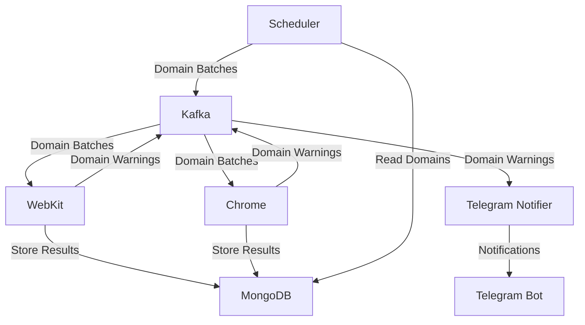

# Domain Sentinel

Domain Sentinel is a distributed system designed to monitor domains for security warnings and notify users when potentially deceptive or unsafe websites are detected. The system uses multiple browser engines (WebKit and Chrome) to check domains and leverages Kafka for message processing and MongoDB for data storage.

## Overview

Domain Sentinel continuously monitors domains for security warnings that browsers display when visiting potentially unsafe websites. When a warning is detected, the system sends notifications via Telegram to alert users about the potential security risk.

The system is built as a set of microservices, each with a specific responsibility:

- **Scheduler**: Manages domain synchronization and batch processing
- **WebKit**: Processes domains using WebKit browser engine
- **Chrome**: Processes domains using Chrome browser engine
- **Telegram Notifier**: Sends notifications to users via Telegram

## System Architecture



## Components

### Scheduler

The scheduler service is responsible for:

- Synchronizing domain data from external sources
- Creating batches of domains for processing
- Sending domain batches to Kafka for processing by browser engines
- Running on a configurable schedule (default: every 5 minutes)

### WebKit

This service:

- Consumes domain batches from Kafka
- Processes each domain using the WebKit browser engine
- Checks for security warnings when visiting domains
- Stores results in MongoDB
- Sends warning notifications to Kafka when detected

### Chrome

Similar to the WebKit service, but uses the Chrome browser engine:

- Consumes domain batches from Kafka
- Processes each domain using the Chrome browser engine
- Checks for security warnings when visiting domains
- Stores results in MongoDB
- Sends warning notifications to Kafka when detected

### Telegram Notifier

This service:

- Consumes domain warning messages from Kafka
- Sends notifications to users via Telegram when warnings are detected
- Formats messages with domain details and warning information

## Technology Stack

- **Backend**: NestJS (Node.js framework)
- **Message Broker**: Apache Kafka
- **Database**: MongoDB
- **Browser Automation**: Playwright
- **Containerization**: Docker & Docker Compose
- **Schema Validation**: Zod
- **Notification**: Telegram Bot API

## Installation and Setup

### Prerequisites

- Docker and Docker Compose
- Node.js (for development)

### Getting Started

1. Clone the repository:

   ```bash
   git clone https://github.com/yourusername/domain-sentinel.git
   cd domain-sentinel
   ```

2. Configure environment variables (optional):
   - Copy `.env.example` to `.env` (if available)
   - Update the variables as needed

3. Start the services using Docker Compose:

   ```bash
   docker-compose up -d
   ```

4. Verify that all services are running:

   ```bash
   docker-compose ps
   ```

## Configuration

The system can be configured using environment variables in the Docker Compose file or through a `.env` file.

### Scheduler Configuration

| Variable             | Description                    | Default                                 |
| -------------------- | ------------------------------ | --------------------------------------- |
| PRICE_UPDATE_CRON    | Cron expression for scheduling | _/5_ \* \* \*                           |
| PRICE_UPDATE_ENABLED | Enable/disable scheduling      | true                                    |
| BATCH_SIZE           | Number of domains per batch    | 2                                       |
| MONGODB_URI          | MongoDB connection string      | mongodb://mongodb:27017/domain_sentinel |

### Telegram Notifier Configuration

| Variable           | Description                        | Default |
| ------------------ | ---------------------------------- | ------- |
| TELEGRAM_BOT_TOKEN | Telegram Bot API token             | -       |
| TELEGRAM_CHAT_ID   | Telegram chat ID for notifications | -       |

### Kafka Configuration

| Variable      | Description            | Default    |
| ------------- | ---------------------- | ---------- |
| KAFKA_BROKERS | Kafka broker addresses | kafka:9093 |

## Usage

Once the system is running, it will automatically:

1. Synchronize domains from configured sources
2. Create batches of domains for processing
3. Check each domain for security warnings using both WebKit and Chrome
4. Send notifications via Telegram when warnings are detected
5. Store results in MongoDB for future reference

### Monitoring

You can monitor the system using:

- **Kafka UI**: Available at <http://localhost:8080>
- **Service logs**: `docker-compose logs -f [service-name]`

## Troubleshooting

### Common Issues

1. **Services fail to start**
   - Check if Kafka and MongoDB are running properly
   - Verify that all required environment variables are set

2. **No notifications are being sent**
   - Verify that the Telegram bot token and chat ID are correct
   - Check the Telegram Notifier logs for errors

3. **Domains are not being processed**
   - Check the scheduler logs to ensure batches are being created
   - Verify that the browser services are consuming messages from Kafka

## Scalability Approach

Domain Sentinel is designed with scalability in mind, allowing it to handle increasing workloads efficiently:

### Horizontal Scaling

- **Microservice Architecture**: Each component can be scaled independently based on workload requirements.
- **Stateless Services**: All services are designed to be stateless, allowing for easy horizontal scaling.
- **Message-Based Communication**: Kafka enables asynchronous processing and decouples services.

### Scaling Strategies

1. **Browser Services**
   - Deploy multiple instances of webkit and chrome services
   - Kafka's consumer groups automatically distribute workload among instances
   - Adjust batch size to optimize throughput based on available resources

2. **Database Scaling**
   - MongoDB can be configured as a replica set for high availability
   - Implement sharding for horizontal scaling when data volume increases
   - Consider using MongoDB Atlas for managed scaling in production

3. **Kafka Scaling**
   - Increase partition count for higher throughput
   - Add more brokers to the Kafka cluster
   - Configure proper retention policies to manage storage

### Performance Optimization

- **Batch Processing**: Adjust batch sizes to balance throughput and resource usage
- **Resource Allocation**: Allocate appropriate CPU and memory resources to each service
- **Caching**: Implement caching strategies for frequently accessed domains
- **Connection Pooling**: Optimize database connections for better performance

## Deployment Plan

### Development Environment

- Use Docker Compose for local development and testing
- Configure services with development-specific settings
- Use volume mounts for code changes without rebuilding containers

### Staging Environment

1. **Infrastructure Setup**
   - Deploy on a Kubernetes cluster or similar orchestration platform
   - Set up monitoring and logging infrastructure
   - Configure staging-specific environment variables

2. **Deployment Process**
   - Use CI/CD pipeline for automated builds and deployments
   - Deploy from feature branches for testing
   - Perform integration tests in the staging environment

### Production Environment

1. **Infrastructure Requirements**
   - Kubernetes cluster with auto-scaling capabilities
   - Managed Kafka service (e.g., Confluent Cloud, MSK)
   - Managed MongoDB service (e.g., MongoDB Atlas)
   - Load balancers for service discovery

2. **Deployment Strategy**
   - Blue/Green deployment for zero-downtime updates
   - Canary releases for gradual rollout of new features
   - Automated rollbacks in case of deployment failures

3. **Monitoring and Maintenance**
   - Implement comprehensive monitoring with Prometheus and Grafana
   - Set up alerting for critical service metrics
   - Regular database backups and maintenance
   - Periodic security audits and updates

4. **Disaster Recovery**
   - Implement multi-region deployment for high availability
   - Regular backup and restore testing
   - Documented recovery procedures for various failure scenarios
