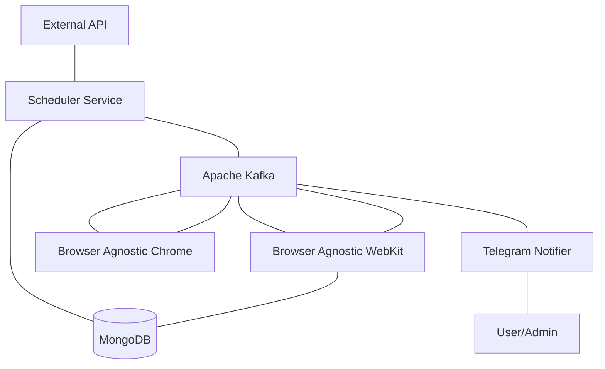

# Domain Sentinel

A distributed system for monitoring domains for security warnings across multiple browsers.

## Overview

Domain Sentinel is a microservice-based application designed to detect security warnings, phishing attempts, and malicious content across websites. It uses multiple browser engines to check domains and sends notifications when security issues are detected.

## Key Features

- **Multi-Browser Support**: Tests domains across Chrome and WebKit browsers
- **Distributed Processing**: Uses Kafka for message distribution and processing
- **Automated Scheduling**: Periodically checks domains based on configurable schedules
- **Real-time Notifications**: Sends alerts via Telegram when security warnings are detected
- **Scalable Architecture**: Microservices design allows for horizontal scaling

## Architecture

The system consists of several microservices:

- **Scheduler**: Manages domain checking schedules and distributes batches of domains
- **Browser Agnostic Services**: Process domains using Playwright with Chrome and WebKit
- **Telegram Notifier**: Sends notifications when security warnings are detected



## Technology Stack

- **Backend**: NestJS (TypeScript)
- **Browser Automation**: Playwright
- **Message Broker**: Apache Kafka
- **Database**: MongoDB
- **Containerization**: Docker & Docker Compose

## Getting Started

### Prerequisites

- Docker and Docker Compose
- Node.js 16+ (for local development)

### Running the Application

1. Clone the repository
2. Start the services:

```bash
docker-compose up -d
```

3. Monitor the services:

```bash
docker-compose logs -f
```

### Configuration

The application is configured through environment variables in the docker-compose.yml file:

- **Kafka Configuration**: Broker addresses, topics, etc.
- **MongoDB Connection**: Database URI
- **Browser Settings**: Browser types and configurations
- **Telegram Notifications**: Bot token and chat ID

## Development

### Building and Testing

```bash
# Install dependencies
npm install

# Build all applications
npm run build

```
